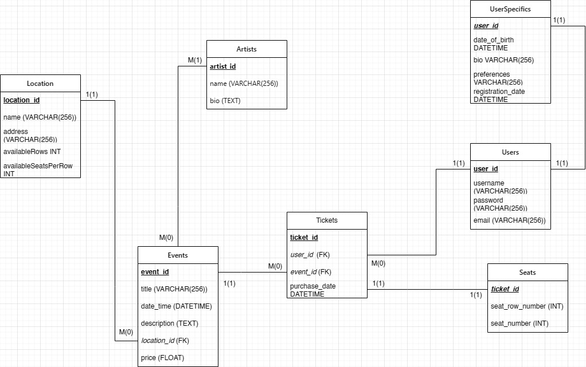

# Booking Show Application
## Proiect Aplicatii Web pentru Baze de Date

Pentru a porni proiectul, se poate rula comanda `docker-compose up` din folderul repo-ului.

Pentru a opri proiectul, se poate rula comanda `docker-compose down` din folderul repo-ului.

Alternativ, se poate rula si din IntellIJ, prin rularea `BookingshowApplication.java` din folderul `src/main/java/com/fmi/bookingshow` pentru backend, respectiv comanda `npm start` din folderul `frontend`, doar ca trebuie mentinuta activa o instanta de MySQL, cu credentialele necesare transmise prin env variables.

Pe o baza de date curata, este necesara rularea scriptului `ci/mysql/init.sql` pentru a defini baza de date default `devdb` (docker composer-ul face by default)

Primul utilizator creat pe platforma va avea by default rolul de administrator, restul vor fi creati cu privilegii de user.

In `api-docs.json` se afla documentatia API-urilor serverului de backend.

# Database schema

